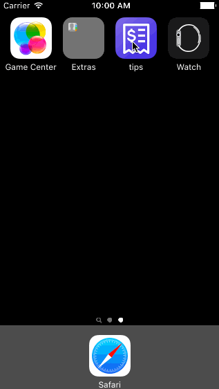
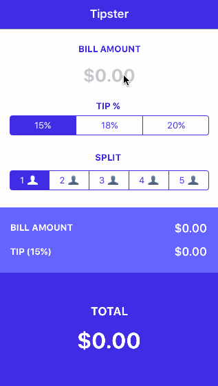
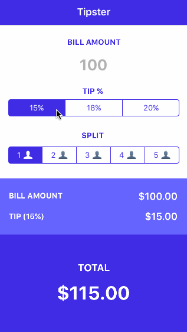
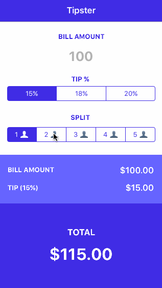

# Tipster

Tipster is a simple iOS Tip Calculator application, based on the [Codepath video tutorial](https://vimeo.com/102084767).

Time spent: 5 hours

### Completed user stories

- Required: User can type a bill amount to calculate tip and total amount.
- Required: User can choose from three different tip percentage options; 15%, 18% and 20%
- Optional: User can split the bill amount for two to five people.
 
### Notes

Spent some time customizing the UI with a new color scheme and app icon and creating an animation block which will fade in when the bill is split for 2 or more people.

### Walkthrough of all user stories

#### Launching the App

#### Typing the bill amount

#### Selecting from different tip percentage options

#### Splitting the bill amount for two to five people

GIF created with [LiceCap](http://www.cockos.com/licecap/).